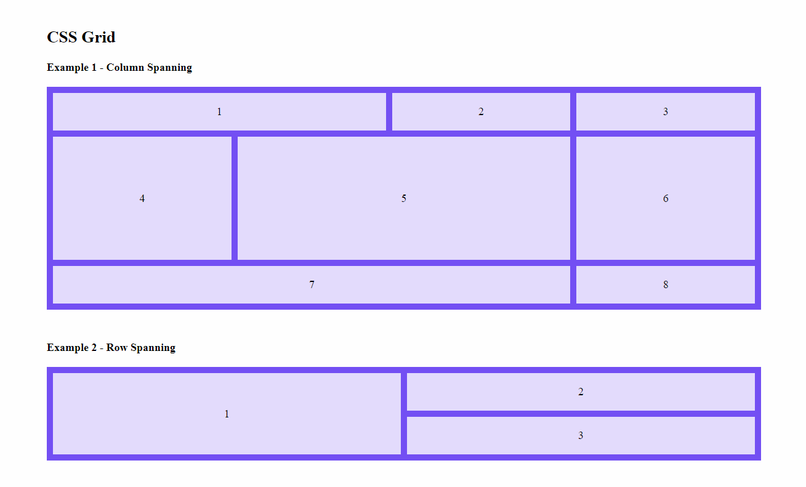

# CSS Grid Examples

This is a simple example guide that can be used as a cheat sheet to jump-start your grid layouts. It contains the most common layouts you might want to use with CSS Grid.

1. Look for the layout that most closely looks like what you are trying to accomplish.

1. Copy and paste the html and css from that example into your project.

1. Tweak it to your liking.

**NOTE:** This guide uses [Sass](https://sass-lang.com/guide) pretty much just for nesting. Look into `sass/global.scss` for all the example CSS.